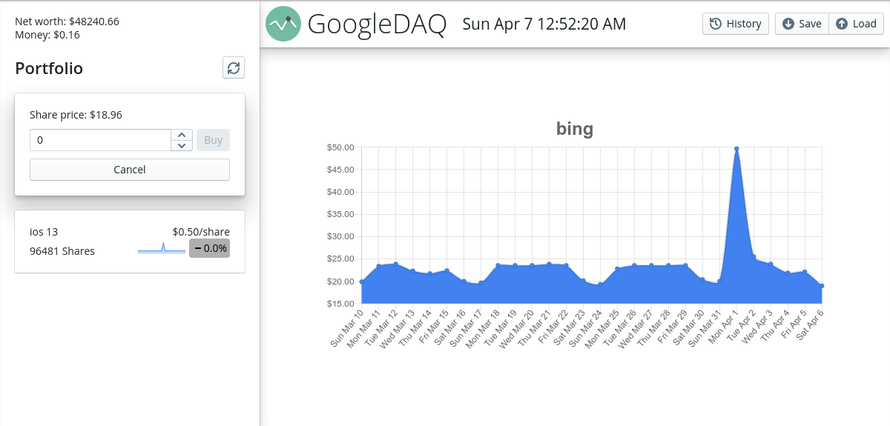
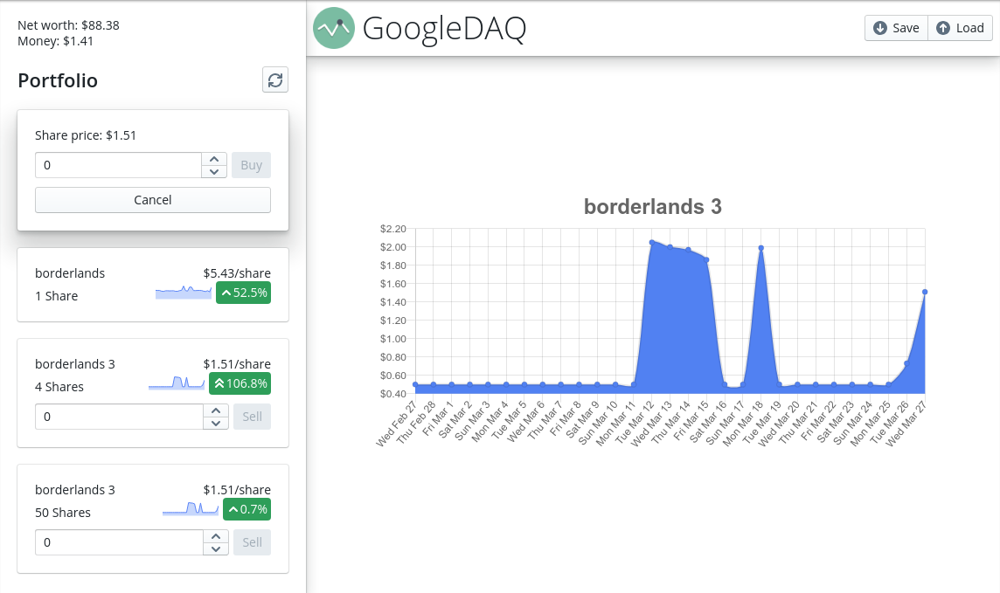

# GoogleDAQ
An idle game where you trade stocks in Google Trends

## Introduction

GoogleDAQ is a game about trading stocks in Google Trends. Your goal is to buy stocks in a search term and sell those stocks when their price peaks. The more Google searches for that search term there are, the higher the price of the stock will be. For example, you could buy stocks in "super bowl" in late January of 2020, and sell them on February 2, 2020, when the stock will peak due to people googling that term.

The price of stocks reset at the beginning of every day, unlike the actual stock market, so to prevent you from simply buying any stock at the beginning of a day and selling it at the end of the day for a guaranteed profit, the current day will only be factored in if the stock price is higher than the previous day. Keep in mind that Google Trends uses the UTC time zone, which is displayed above.

You only start off with $100, so you won't be able to buy any of the big stocks, so start with something small. Maybe it's a weekend and you want to invest in something that you think people will be more likely to search on a weekday.

## Screenshots (click to enlarge)

<table>
	<tr>
		<td>
			
		</td>
		<td>
			
		</td>
	</tr>
	<tr>
		<td>
			
		</td>
		<td>
			
		</td>
	</tr>
</table>

## Downloading

There are [releases](https://github.com/reujab/googledaq/releases) for Linux and Windows (macOS builds coming soon).
